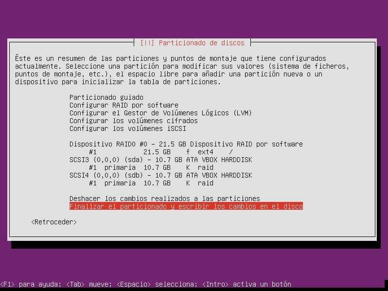
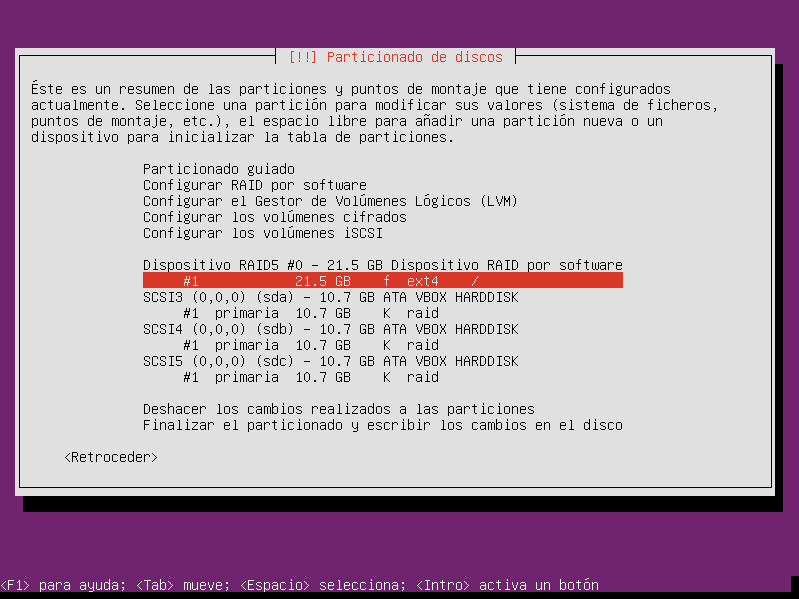

# Ejercicio-dns
## Creación de las máquinas
Creamos el raid 0 para el servidor dns.

Creamos el raid 5 para el servidor web y ftp.

## Creación del servidor DNS
Declarar las zonas de los sitios.

Configurar los servidores DNS a los que va a acudir nuestro servidor en el caso de que nos conozca la IP del nombre por el que le están preguntando.

Crear las zonas directas de cada sitio donde se relacionan las IP con los nombres.

## Creación del servidor Apache
Crear los host virtuales, para ello hay que crear primero la estructura de carpetas y luego configurar los archivos.

## Comprobación desde el lado del cliente
Comprobación de los host por el terminar de un cliente.

Comprobación de los host en el navegador del cliente.

